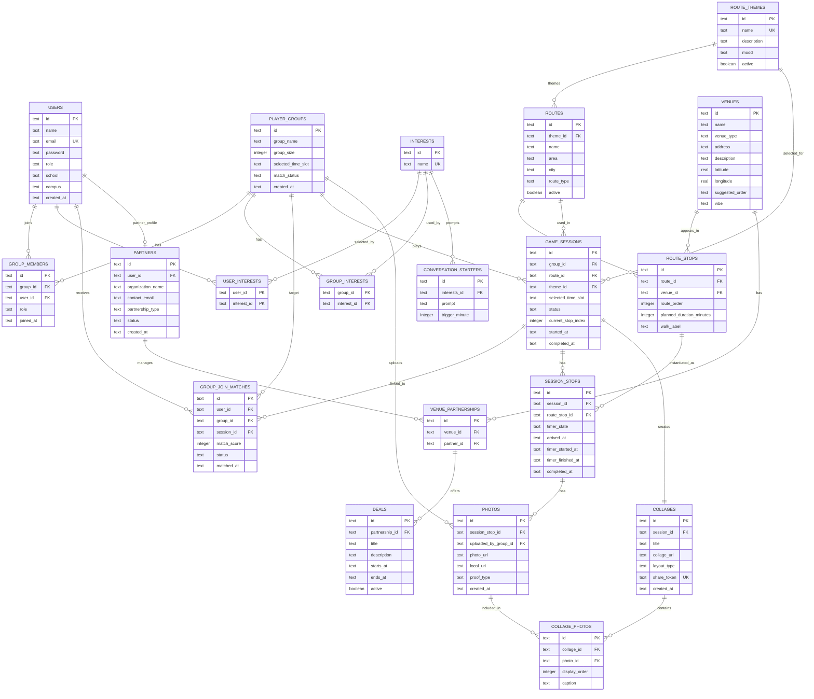

# Global To Social 010

Mono Repo for TLE-4

**Target audience:** International students at Hogeschool Rotterdam's International Business programme (700+ per year) who want to build a social network in a new city.

**Problem:** Studying together doesn't translate into knowing each other different languages, cultures and a new city make it hard to form connections outside of class.

**Solution:** Global To Social 010 matches students into small groups based on shared interests and sends them on social routes through Rotterdam (e.g. a pub crawl or an alcohol-free café route). Each stop comes with interest-based conversation starters and interactive challenges that break the ice, while the app tracks group progress and photo collages of the route.

## Docs

- [Project Structure](./docs/project-structure.md)
- [Conventions](./docs/conventions.md)
- [Form](./docs/form.md)
- [Query](./docs/query.md)

## Entity Relationship Diagram



## Installation

### Development

Requires Node 22+ and pnpm.

```bash
# Install all workspace dependencies (run once from the repo root)
pnpm install
```

```bash
# Configure the API env, then start the API (http://localhost:8000)
cp apps/api/.env.example apps/api/.env   # fill in JWT_SECRET / JWT_REFRESH_SECRET
pnpm run dev:api
```

Start whichever app you're working on:

```bash
pnpm run dev:web      # website  → http://localhost:3000 (proxies /api to the API on :8000)
pnpm run dev:mobile   # mobile app (Expo)
```

Seed the database with baseline data (optional, idempotent):

```bash
pnpm --filter api db:seed
```

#### Mobile on a real device (ngrok tunnel)

The mobile app can't reach `localhost`, so expose the API through a tunnel:

```bash
# One-time: add your token (https://dashboard.ngrok.com/get-started/your-authtoken)
npx ngrok config add-authtoken <your-token>
# Start the tunnel, then paste the printed URL into apps/mobile/constants/api.js (Create it if it does not exist with `export const API_URL = "<your-url>")
pnpm run dev:tunnel
```

### Deployment

Two apps deploy independently to Coolify, each with its own Dockerfile and guide:

- **API** — root `Dockerfile`, see [apps/api/README.md](./apps/api/README.md)
- **Website** — `apps/web/Dockerfile`, see [apps/web/README.md](./apps/web/README.md)

### Edge Cases

**Websockets**

- Android devices disconnect and reconnect quickly when taking a pictures, if the next stop starts any issues get fixed.
- If a member of a group closes the application and disconnect to the websocket there are instances the route soft locks and can't properly continue.

**Website**

- Normal users can also log-in but there are no features for them.

**Mobile app**

- You don't get redirected to select interests when making an account which can lead to user confusion.
- Quick queue button has issues with not properly redirecting the user.

**Deployment**

- The deployment server needs more then 2GB RAM and 2 CPU cores or there are chances it will crash during deployment.
